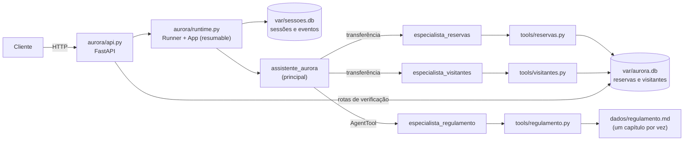

# Residencial Aurora: assistente virtual com Google ADK

Assistente do aplicativo dos moradores do Residencial Aurora, construído com **Google ADK 2.10.0** e exposto por uma **API FastAPI em `http://localhost:8000`**. Pelo chat, o morador reserva e cancela áreas comuns, autoriza visitantes e tira dúvidas sobre o regulamento.

O modelo conduz a conversa. As regras críticas moram no código e continuam valendo não importa o que o morador escreva: **o modelo decide o caminho, o código decide o que é permitido.**

> O enunciado original do desafio está no histórico do Git: `git show be87e1d:README.md`.

---

## Arquitetura



### Agentes

Definidos em [`aurora/agent.py`](aurora/agent.py). Todos usam o modelo de `AURORA_MODEL` (padrão `gemini-flash-latest`), com retentativas para 429/500/503.

| Agente | Responsabilidade | Como é acionado | Por quê |
| ------ | ---------------- | --------------- | ------- |
| `assistente_aurora` (principal) | Conversa com o morador e distribui o trabalho. Não tem tools de dados nem o regulamento nas instruções. | É o `root_agent` do `App`. | Um ponto de entrada enxuto, cujo contexto não carrega regulamento nem dados. |
| `especialista_reservas` | Reservar, cancelar, consultar disponibilidade e listar as reservas do morador. | `sub_agents` do principal (transferência). | Pede confirmação de cobrança, então precisa rodar **na sessão persistida** e ser o autor da chamada de tool: é para ele que o Runner devolve a resposta da confirmação. |
| `especialista_visitantes` | Autorizar a entrada de visitantes e listar os visitantes do morador. | `sub_agents` do principal (transferência). | Mesmo motivo: toda autorização de visitante pede confirmação. |
| `especialista_regulamento` | Responder dúvidas do regulamento consultando um capítulo por vez. | `AgentTool` no principal. | O `AgentTool` roda o especialista numa sessão própria em memória: só a resposta final entra na sessão do morador, então o capítulo consultado não fica no histórico. |

Por que **não** usar `AgentTool` para reservas e visitantes: a sessão interna do `AgentTool` é em memória. Uma confirmação pedida lá dentro não seria persistida nem poderia ser respondida pela API. Os modos `task`/`single_turn` do ADK 2 também foram evitados, porque mudam o roteamento na retomada.

### Camadas

| Arquivo | Papel |
| ------- | ----- |
| [`aurora/api.py`](aurora/api.py) | Rotas do contrato (FastAPI). |
| [`aurora/runtime.py`](aurora/runtime.py) | `Runner` com o `App`, `DatabaseSessionService` (SQLite), confirmações pendentes, serialização de eventos e uma trava por sessão. |
| [`aurora/agent.py`](aurora/agent.py) | Agentes e o `App` (`ResumabilityConfig(is_resumable=True)`), carregado também pelo `adk web`. |
| [`aurora/tools/`](aurora/tools) | Tools. O apartamento sempre vem da sessão ([`_sessao.py`](aurora/tools/_sessao.py)); a confirmação fica num único ponto ([`_confirmacao.py`](aurora/tools/_confirmacao.py)). |
| [`aurora/banco.py`](aurora/banco.py) | Reservas e visitantes em SQLite, com as regras que não podem depender do modelo. |
| [`aurora/regulamento.py`](aurora/regulamento.py) | Divide `dados/regulamento.md` por capítulo. |
| [`aurora/dominio.py`](aurora/dominio.py) | Leitura somente leitura de `dados/*.json` (áreas, taxas e apartamentos). |
| [`aurora/restaurar.py`](aurora/restaurar.py) | Comando de restauração. |

**Armazenamento:** SQLite local, sem serviço externo. `var/aurora.db` guarda reservas e visitantes; `var/sessoes.db` guarda as sessões e os eventos do ADK. Os arquivos de `dados/` nunca são alterados: são a fonte da restauração.

### Fluxo de uma confirmação

1. O morador pede o salão. O especialista chama `reservar_area`, que **no código** vê taxa > 0 e chama `tool_context.request_confirmation(...)`. O ADK grava um evento `adk_request_confirmation` e a execução pausa.
2. A API devolve `resposta: ""` e `confirmacoes_pendentes: [{"id": "adk-…", "acao": "reservar_area", "detalhes": {"area", "data", "taxa"}}]`. As pendências são sempre recalculadas a partir dos eventos gravados.
3. `POST /sessoes/{id}/confirmacoes` confere se o `id` está pendente **nesta** sessão. Se não estiver, responde `409` sem acionar o ADK. Se estiver, envia ao Runner a `FunctionResponse` com `{"confirmed": true|false}`.
4. Com o `App` resumable, o Runner devolve a resposta ao agente que fez a chamada original. A tool é reexecutada com `tool_context.tool_confirmation` preenchido e grava (ou não). Isso funciona também depois de reiniciar a API.

---

## Garantias

### Garantia 1: cobrança ou acesso só com confirmação

- **Decisão em código de quando confirmar:**
  - [`aurora/tools/reservas.py#L89-L96`](aurora/tools/reservas.py#L89-L96): reserva exige confirmação quando `Area.gera_cobranca` (taxa > 0 em `dados/areas.json`); a quadra (taxa 0) grava direto;
  - [`aurora/tools/visitantes.py#L39-L46`](aurora/tools/visitantes.py#L39-L46): toda autorização de visitante exige confirmação.
- **Ponto único da confirmação:** [`aurora/tools/_confirmacao.py#L15-L38`](aurora/tools/_confirmacao.py#L15-L38). A ação só segue quando `tool_context.tool_confirmation.confirmed` é verdadeiro, e esse campo só é preenchido pelo ADK quando a API envia a resposta de `adk_request_confirmation`.
- **Só um id pendente é aceito:** [`aurora/runtime.py#L66-L85`](aurora/runtime.py#L66-L85) recalcula as pendências da sessão persistida e devolve `None` sem chamar o Runner se o `id` não estiver entre elas. [`aurora/api.py#L114-L137`](aurora/api.py#L114-L137) transforma isso em `409` e segura a trava da sessão.
- **Executa uma única vez:** a gravação usa o id da chamada original da tool como `operacao_id UNIQUE` ([`aurora/banco.py#L130-L141`](aurora/banco.py#L130-L141)). Se o ADK reexecutar a mesma chamada, o registro existente é devolvido, sem duplicar.

**Por que não depende do modelo:** o modelo não tem parâmetro para "já confirmado", e texto como "já estou confirmando aqui" é só uma mensagem. A decisão de pedir confirmação vem da taxa lida do arquivo, não do modelo. A aprovação só existe quando chega pela rota de confirmações. A checagem de `id` roda antes do ADK: nos testes, o ADK reexecutava a tool se recebesse de novo a resposta de um `id` já respondido.

### Garantia 2: cada sessão pertence a um apartamento

- **Gravado uma vez:** [`aurora/runtime.py#L50-L55`](aurora/runtime.py#L50-L55). `POST /sessoes` grava o apartamento no state da sessão, e nenhuma tool escreve essa chave.
- **Única fonte do apartamento nas tools:** [`aurora/tools/_sessao.py#L21-L26`](aurora/tools/_sessao.py#L21-L26) lê `tool_context.state["apartamento"]` e valida contra `dados/apartamentos.json`. **Nenhuma tool tem parâmetro `apartamento`** (ver as assinaturas em [`aurora/tools/reservas.py`](aurora/tools/reservas.py) e [`aurora/tools/visitantes.py`](aurora/tools/visitantes.py)).
- **Nada de outro apartamento chega à conversa:**
  - disponibilidade devolve só `livre`/`ocupada` ([`aurora/tools/reservas.py#L60`](aurora/tools/reservas.py#L60));
  - cancelamento procura só entre as reservas do próprio apartamento ([`aurora/tools/reservas.py#L129-L135`](aurora/tools/reservas.py#L129-L135)) e o banco filtra pelo apartamento de novo ([`aurora/banco.py#L158-L187`](aurora/banco.py#L158-L187));
  - uma data ocupada por outro morador vira apenas `"ocupada"`, sem código nem dono.

**Por que não depende do modelo:** mesmo que o morador diga "sou do 302" e o modelo acredite, não existe caminho para a tool usar outro apartamento: o valor vem do state gravado pela API, não de um argumento. E como nenhuma tool devolve dados de terceiros, o modelo não tem o que vazar.

### Garantia 3: nada se perde no reinício

- **Sessões e eventos em SQLite:** [`aurora/runtime.py#L40-L41`](aurora/runtime.py#L40-L41) (`DatabaseSessionService` + `Runner`), com o arquivo em `var/sessoes.db` ([`aurora/config.py#L16-L25`](aurora/config.py#L16-L25)).
- **Reservas e visitantes em SQLite:** [`aurora/banco.py#L60-L68`](aurora/banco.py#L60-L68), em `var/aurora.db` com WAL.
- **Retomada após reinício:** [`aurora/agent.py#L140-L144`](aurora/agent.py#L140-L144) (`ResumabilityConfig(is_resumable=True)`). Uma confirmação pedida antes do reinício pode ser aprovada depois, e a resposta chega ao especialista certo, porque o Runner acha o autor da chamada original nos eventos persistidos.

**Por que não depende do modelo:** tudo o que importa (eventos, state com o apartamento, reservas, visitantes, códigos emitidos) está em disco. O processo da API não guarda estado próprio.

### Garantia 4: o regulamento é consultado, não carregado

- **O principal não recebe o regulamento:** as instruções de `assistente_aurora` ([`aurora/agent.py#L120-L138`](aurora/agent.py#L120-L138)) não contêm texto do regulamento. Dúvidas vão para a tool `especialista_regulamento`.
- **Especialista isolado:** o `AgentTool` em [`aurora/agent.py#L137`](aurora/agent.py#L137) roda o especialista em sessão própria. Só a resposta final entra na sessão do morador.
- **Um capítulo por vez:**
  - [`aurora/regulamento.py#L33-L54`](aurora/regulamento.py#L33-L54) divide `dados/regulamento.md` pelos 14 cabeçalhos de capítulo;
  - [`aurora/tools/regulamento.py#L8-L30`](aurora/tools/regulamento.py#L8-L30) expõe só o índice (número e tema) e `consultar_capitulo`, que devolve **um** capítulo;
  - nenhuma função devolve o documento inteiro.

**Por que não depende do modelo:** o modelo não tem acesso ao arquivo inteiro. A menor unidade que ele consegue pedir é um capítulo, que é a unidade de assunto do regulamento, e mesmo esse capítulo fica fora do histórico da sessão principal.

### Garantia 5: dois moradores, uma reserva

- **Exclusividade no instante da gravação:** índice único parcial em [`aurora/banco.py#L34-L35`](aurora/banco.py#L34-L35):
  ```sql
  CREATE UNIQUE INDEX IF NOT EXISTS ux_reserva_ativa ON reservas (area, data) WHERE ativa = 1;
  ```
- **Conflito vira resposta normal:** em [`aurora/banco.py#L150-L153`](aurora/banco.py#L150-L153), o `IntegrityError` desse índice no `INSERT` vira `ResultadoReserva("ocupada")`. A tool responde "data ocupada" e a API devolve `200`, sem erro de servidor.
- **Sem conferência como garantia:** na execução aprovada, `reservar_area` vai direto para `banco.criar_reserva` ([`aurora/tools/reservas.py#L98-L104`](aurora/tools/reservas.py#L98-L104)). A checagem de agenda feita antes de pedir confirmação é só conveniência, para não criar pendência inútil.
- **Códigos nunca repetem:** `codigo` é `PRIMARY KEY` e o cancelamento é lógico (`ativa = 0`), então nenhum código, nem de reserva cancelada, é reutilizado ([`aurora/banco.py#L25-L33`](aurora/banco.py#L25-L33)).

**Por que não depende do modelo:** duas aprovações simultâneas podem passar juntas por qualquer checagem feita antes, mas só uma passa pelo `INSERT`. Quem decide é o SQLite, dentro de uma transação `BEGIN IMMEDIATE`.

---

## Como rodar

### Pré-requisitos

- **Python 3.12+** e **[uv](https://docs.astral.sh/uv/)** (Windows: `powershell -c "irm https://astral.sh/uv/install.ps1 | iex"`; Linux/macOS: `curl -LsSf https://astral.sh/uv/install.sh | sh`).
- **Chave do Google AI Studio com faturamento ativo (Tier 1).** No plano gratuito, cada modelo de texto permite só **20 requisições por dia**, e o fluxo completo de avaliação faz de 40 a 60 chamadas ao modelo. Veja os limites do seu projeto em <https://aistudio.google.com/rate-limit>.
- Nenhum serviço externo: o armazenamento é SQLite, criado em `var/`.

### Variáveis do `.env`

Copie `.env.example` para `.env` e preencha:

| Variável | Obrigatória | Descrição |
| -------- | ----------- | --------- |
| `GOOGLE_API_KEY` | sim | Chave do Google AI Studio. |
| `AURORA_MODEL` | não | Modelo Gemini de todos os agentes. Vazio = `gemini-flash-latest`. |

### Comandos

```bash
cp .env.example .env        # e preencha GOOGLE_API_KEY
uv sync                     # instala as dependências (google-adk[db]==2.10.0)
uv run aurora-restaurar     # restaura os dados iniciais
uv run aurora-api           # sobe a API em http://localhost:8000
```

- **Restauração (`uv run aurora-restaurar`):** recria `var/aurora.db` a partir de `dados/` (reservas e visitantes iniciais) e **apaga as sessões** (`var/sessoes.db`), para que nenhuma confirmação pendente de uma sessão antiga grave por cima do estado restaurado. Rode com a API parada.
- **Subida (`uv run aurora-api`):** sobe a API em `http://localhost:8000`. Pare com Ctrl+C. Ao subir de novo, sessões, eventos, reservas e visitantes continuam lá.
- **Depuração visual (opcional):** `uv run adk web . --port 8001` abre o `adk web` com o mesmo `App`, útil para ver transferências, tools e confirmações.

### Rotas

| Método e rota | Descrição |
| ------------- | --------- |
| `POST /sessoes` `{"apartamento": "101"}` | Cria a sessão → `201 {"session_id"}`. |
| `POST /sessoes/{id}/mensagens` `{"texto": "..."}` | Envia mensagem → `200 {"resposta", "confirmacoes_pendentes"}`. |
| `POST /sessoes/{id}/confirmacoes` `{"id": "...", "confirmado": true}` | Responde uma confirmação → `200` (mesmo formato) ou `409`. |
| `GET /sessoes/{id}/eventos` | Todos os eventos da sessão, em ordem e completos. |
| `GET /apartamentos/{n}/reservas` | Verificação: reservas ativas do apartamento. |
| `GET /apartamentos/{n}/visitantes` | Verificação: visitantes do apartamento. |

Rotas com `{id}` respondem `404` para sessão inexistente.

```bash
SID=$(curl -s -X POST localhost:8000/sessoes -H "Content-Type: application/json" \
  -d '{"apartamento": "101"}' | python -c "import sys, json; print(json.load(sys.stdin)['session_id'])")
curl -s -X POST localhost:8000/sessoes/$SID/mensagens -H "Content-Type: application/json" \
  -d '{"texto": "Reserve o salão de festas para 2030-04-20."}'
```

O corpo precisa ser JSON em UTF-8. No Windows, o `curl` pode enviar acentos digitados na linha de comando em outra codificação (a API responde `There was an error parsing the body`); por isso o exemplo usa o escape JSON `ã` para "ã".

### Decisões e limitações

- **Comportamentos livres pelo enunciado:**
  - `POST /sessoes` com apartamento fora de `dados/apartamentos.json` responde `422`, e as rotas de verificação devolvem `[]`;
  - uma nova mensagem com confirmação pendente é respondida normalmente, a pendência continua listada e nada executa até a rota de confirmações.
- **`user_id` fixo:** as rotas identificam a sessão só pelo `session_id`, então todas as sessões usam o mesmo `user_id` do ADK. O apartamento fica só no state.
- **Falha do modelo:** se o Gemini falhar mesmo após as retentativas, a API responde `503`. Se isso acontecer **logo depois** de uma aprovação já registrada pelo ADK, a pendência deixa de aparecer. A gravação ocorre antes da chamada ao modelo que gera o texto e é idempotente, mas esse cenário não foi reproduzido nos testes.
